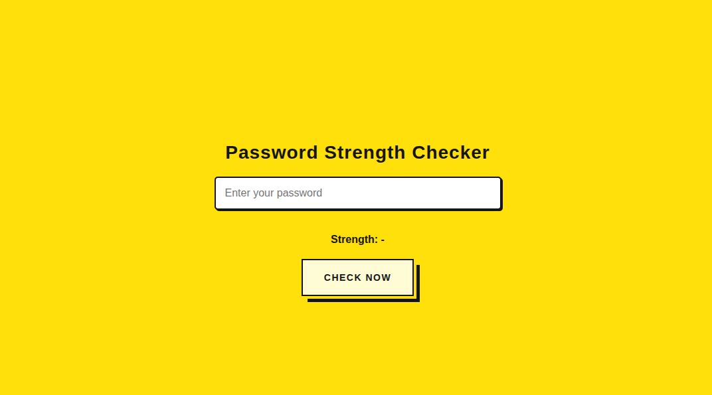

# 🔐 Password Strength Checker

A simple and stylish web app that checks the strength of a user's password in real-time.  
Built with HTML, CSS, and JavaScript — and fully responsive for mobile.

 <!-- optional: add a screenshot image here -->

---

## ✨ Features

- ✅ Live password strength checking
- ✅ Detects uppercase, lowercase, numbers, and special characters
- ✅ Stylish UI inspired by retro web design
- ✅ Mobile-friendly & fully responsive
- ✅ Hosted with GitHub Pages

---

## 💻 Live Demo

👉 [Click here to try it now](https://abdullah-5509.github.io/Password-Check/)  
